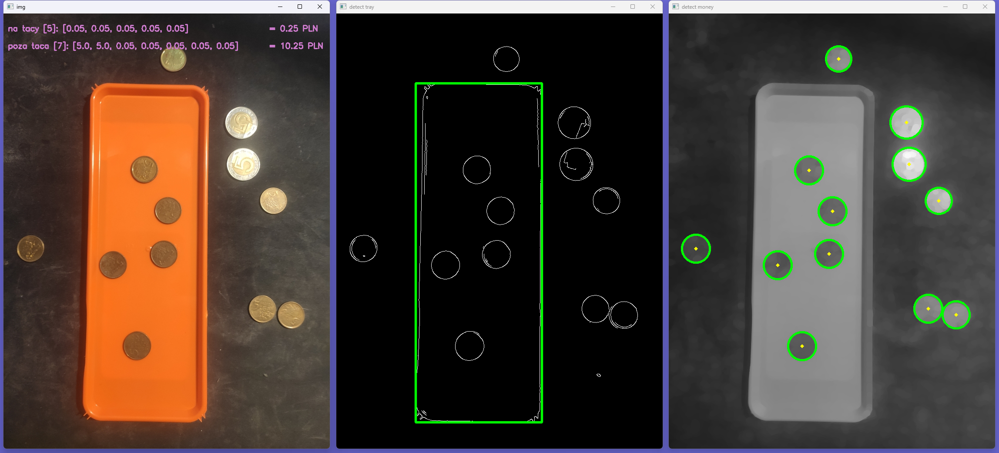
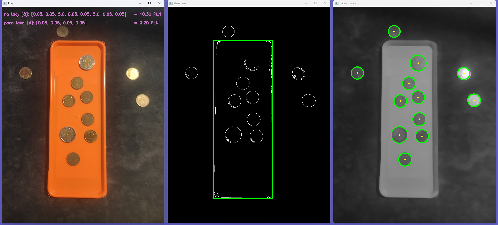

# Coin Detection OpenCV

Coin detection and counting implementation using Python and OpenCV.

## Demo

## Features

* Coin detection using Hough circles
* Tray detection using Hough lines
* Coin classification by radius
* Separation of coins on and outside the tray
* Value calculation and image annotation

## Technologies

* Python
* OpenCV
* NumPy

## How to run

pip install opencv-python numpy
python main.py
